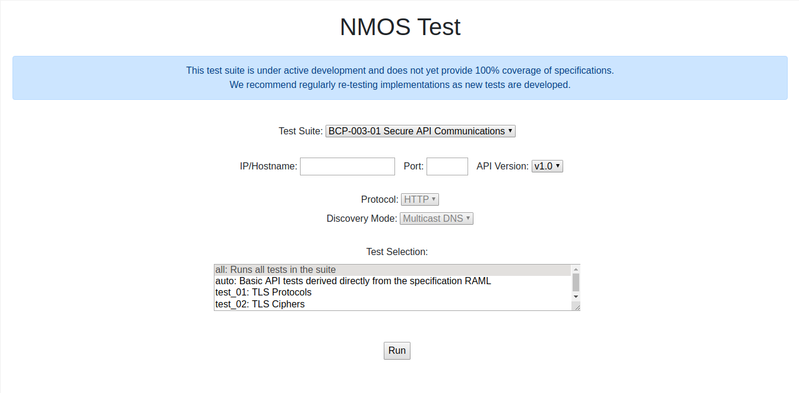
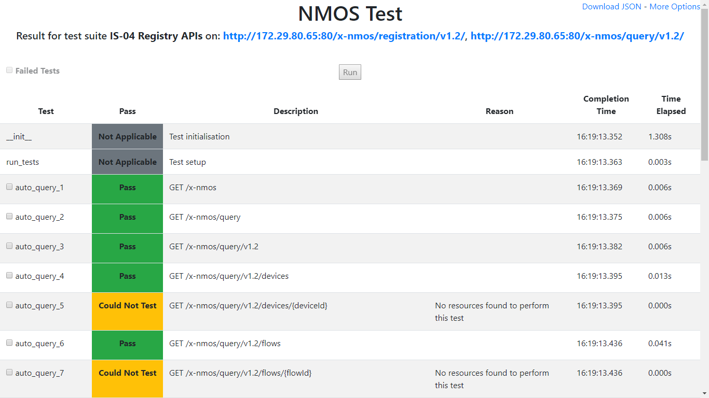

# NMOS API Testing Tool  

This tool creates a simple web service which tests implementations of the NMOS APIs.

 | 
--- | ---

The following test suites are currently supported:
*   IS-04 Node API
*   IS-04 Registry APIs
*   IS-04 Node API (Peer to Peer)
*   IS-05 Connection Management API
*   IS-05 Interaction with IS-04
*   IS-06 Network Control API
*   IS-07 Event & Tally API
*   IS-07 Interaction with IS-04 and IS-05
*   IS-08 Channel Mapping API
*   IS-08 Interaction with IS-04
*   IS-09 System API
*   IS-09 System API Discovery
*   IS-10 Authorization API
*   BCP-002-01 Natural Grouping (see IS-04 Node API)
*   BCP-003-01 Secure API Communications
*   BCP-003-02 Authorization (see IS-10 Authorization API)

When testing any of the above APIs it is important that they contain representative data. The test results will generate 'Could Not Test' results if no testable entities can be located. In addition, if devices support many modes of operation (including multiple video/audio formats) it is strongly recommended to re-test them in multiple modes.

## Installation & Usage

Detailed instructions can be found in the [documentation](docs/)

## Important Notes
*   The IS-04 Node and IS-09 Discovery tests create mock mDNS announcements on the network unless the `nmostesting/Config.py` `ENABLE_DNS_SD` parameter is set to `False`, or the `DNS_SD_MODE` parameter is set to `'unicast'`. It is critical that these tests are only run in isolated network segments away from production Nodes and registries. Only one Node can be tested at a single time. If `ENABLE_DNS_SD` is set to `False`, make sure to update the Query API hostname/IP and port via `QUERY_API_HOST` and `QUERY_API_PORT` in the `nmostesting/Config.py`.
*   For IS-05 tests #29 and #30, and IS-08 test #4 (absolute activation), make sure the time of the test device and the time of the device hosting the tests is synchronized.
