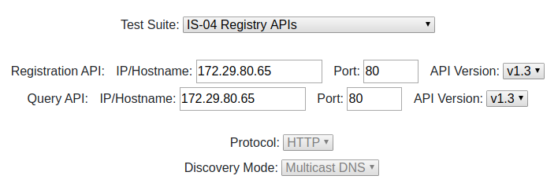
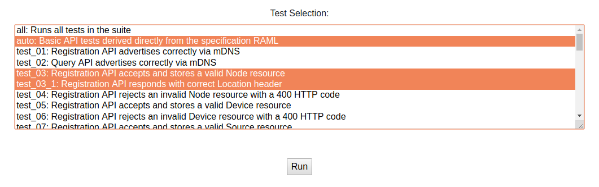

# Usage

The following guide indicates how to run the tool against an implementation of one of the NMOS APIs.

Description | Screenshot
--- | ---
Open a browser and go to the address of the server you [deployed](1.0.%20Installation.md). | 
Select a test suite from the dropdown. | 
Provide the IP or hostname and port of the relevant API under test, along with the preferred API version. | 
Optionally, select a subset of the tests to run. This should default to 'all'. | 
Once all of the field have been completed, press 'Run'. The result of the tests will be shown after a few seconds. |

## Understanding the Results

The result of each test case will be one of the following:

| Pass | Reason |
| - | - |
|  | Successful test case. |
|  | Required feature of the specification has been found to be implemented incorrectly. |
|  | Not a failure, but the API being tested is responding or configured in a way which is not recommended in most cases. |
|  | Test is disabled due to test suite configuration; change the config or test manually. |
|  | Test was not run due to prior responses from the API, which may be OK, or indicate a fault. |
|  | Recommended/optional feature of the specifications has been found to be not implemented. |
|  | Test suite does not currently test this feature, so it must be tested manually. |
|  | Test is not applicable, e.g. due to the version of the specification being tested. |

## Test-specific Documentation

The following pages provide information on additional instructions for testing specific features:

- [Unicast Discovery](2.1.%20Usage%20-%20Testing%20Unicast%20Discovery.md)
- [BCP-003-01](2.2.%20Usage%20-%20Testing%20BCP-003-01%20TLS.md)
- [Authorization](2.3.%20Usage%20-%20Testing%20IS-10%20Authorization.md)
- [SDP Files](2.4.%20Usage%20-%20Testing%20of%20SDP%20Files.md)

## Non-interactive Testing

The testing tool supports two modes of operation that support usage in larger scale or continuous integration tests.

- [Non-Interactive Mode](2.5.%20Usage%20-%20Non-Interactive%20Mode.md)
- [Using the API](2.6.%20Usage%20-%20Using%20the%20API.md)

## Advanced Testing

Some of the tests contained within this tool perform a number of steps which may not be obvious without viewing the source code. To help with debugging, descriptions of such behaviour is covered by the [advanced testing](5.0.%20Advanced%20Testing.md) pages.
